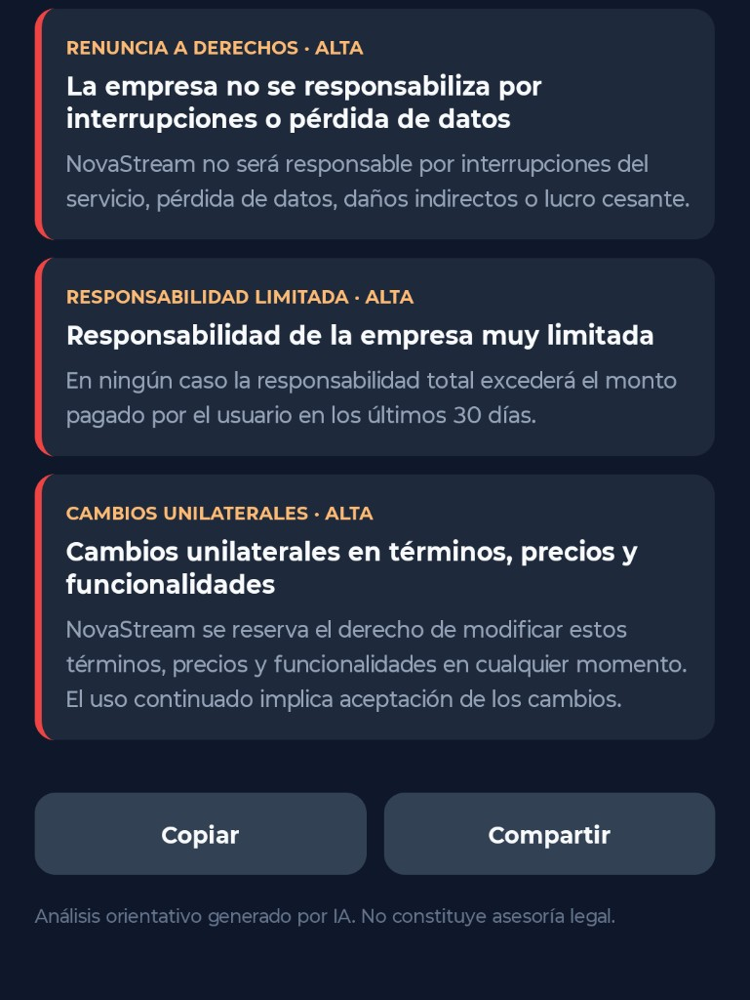
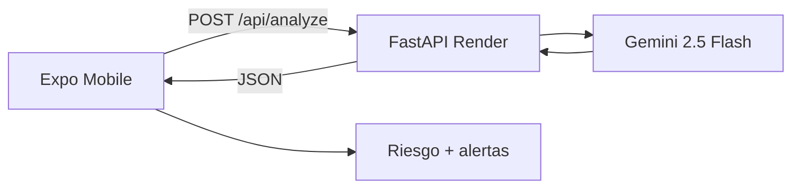

# ScanTerms

[](https://expo.dev/)
[](https://reactnative.dev/)
[](https://fastapi.tiangolo.com/)
[](https://ai.google.dev/)

App **React Native (Expo)** + API **FastAPI** para analizar términos y condiciones con **Gemini** y detectar alertas de riesgo.

**Demo en vivo (API):** [scanterms-api.onrender.com/docs](https://scanterms-api.onrender.com/docs)  
**Repositorio:** [github.com/ElBarSimson9593/scantterms](https://github.com/ElBarSimson9593/scantterms)

> Proyecto de portafolio — LegalTech / defensa del consumidor  
> Análisis orientativo por IA. No constituye asesoría legal.  
> La app móvil se muestra en capturas; la API desplegada se prueba en Swagger.

## Qué hace

1. Pegas texto de T&C en la app móvil.
2. La API analiza con Gemini 2.5 Flash.
3. Ves **nivel de riesgo**, **resumen** y **alertas rojas** por categoría.
4. Copias o compartes el resultado.

## Demo en vivo

Prueba la **API desplegada en Render** desde Swagger (texto de T&C de ejemplo en `POST /api/analyze`):

**[https://scanterms-api.onrender.com/docs](https://scanterms-api.onrender.com/docs)**

Health check: [scanterms-api.onrender.com/health](https://scanterms-api.onrender.com/health)

> El free tier de Render entra en sleep tras inactividad (~30–60 s al despertar).

## Capturas

### Pantalla principal


### Entrada de texto (ejemplo ficticio NovaStream)


### Resultado — resumen y nivel de riesgo


### Alertas rojas por categoría


### Copiar y compartir resultado



## Estructura

```
ScanTerms/
├── mobile/     Expo + TypeScript
├── api/        FastAPI (GEMINI_API_KEY solo aquí)
└── docs/       PRD, samples, evidencia
```

## Requisitos

- Node.js 20+
- Python 3.11+
- Cuenta Google AI Studio (free tier)
- Expo Go en el celular (opcional) o emulador Android

## 1. Backend (API)

```bash
cd api
cp .env.example .env
# Configurar GEMINI_API_KEY en .env

python -m venv .venv
.venv\Scripts\activate        # Windows
pip install -r requirements.txt
uvicorn app.main:app --reload --host 0.0.0.0 --port 8000
```

Health check: http://localhost:8000/health

## 2. Mobile (Expo)

```bash
cd mobile
cp .env.example .env
npm install
npx expo start -c
```

**`mobile/.env`** — opciones de `EXPO_PUBLIC_API_URL`:

| Escenario | Valor |
|-----------|--------|
| Celular físico sin API local | `https://scanterms-api.onrender.com` (default) |
| Celular físico + API local | `http://<IP_LAN>:8001` (IP del host en la red Wi‑Fi) |
| Emulador Android | `http://10.0.2.2:8001` |

> En dispositivos físicos, `localhost` apunta al teléfono, no al host de desarrollo. Tras modificar `.env`, reiniciar Metro con `npx expo start -c`.

## API

```http
POST /api/analyze
Content-Type: application/json

{ "text": "..." }
```

## Deploy en Render (free tier)

1. En [render.com](https://render.com): **New** → **Blueprint** → conectar el repo `scantterms`.
2. Configurar `GEMINI_API_KEY` en las variables de entorno del Blueprint.
3. Verificar [scanterms-api.onrender.com/health](https://scanterms-api.onrender.com/health) tras el deploy.
4. En `mobile/.env`: `EXPO_PUBLIC_API_URL=https://scanterms-api.onrender.com`

## Samples de demo

- [docs/samples/ficticio-novastream.txt](docs/samples/ficticio-novastream.txt)
- [docs/samples/ficticio-fittrack.txt](docs/samples/ficticio-fittrack.txt)

La app incluye botón **Cargar ejemplo ficticio**.

## Stack

| Capa | Tecnología |
|------|------------|
| Mobile | Expo 56, React Native, TypeScript |
| API | FastAPI, Gemini 2.5 Flash |
| Costo | $0 (free tier) |

## Arquitectura



> `GEMINI_API_KEY` solo en el backend — no en la app móvil.

Documento de requisitos: [docs/PRD.md](docs/PRD.md)

## Autor

**Osvaldo Andrés Díaz Guzmán** — Backend e IA aplicada

## Proyectos relacionados

- [SentimentTrend Bot](https://github.com/ElBarSimson9593/sentiment-trend-bot)
- [MeetScribe AI](https://github.com/ElBarSimson9593/meetscribe-ai)
